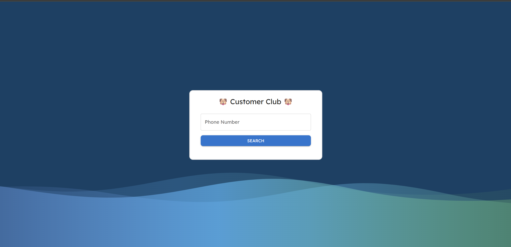
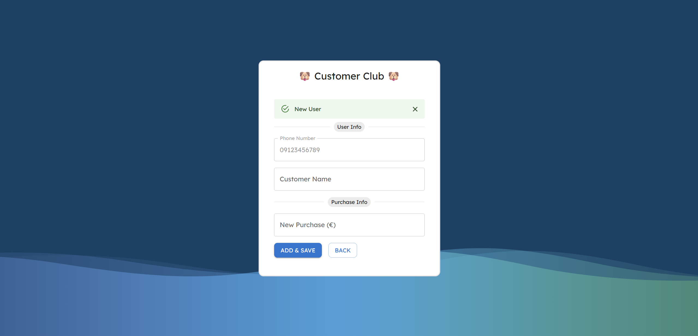

# Customer Club 🎉

A simple, elegant customer loyalty web app built with **React JS** and **Python Flask**, styled using **Emotion CSS** and **Material UI** components. This project is designed to run locally and showcases a clean, responsive UI for managing customer purchases.

---

## 🚀 Features

- 🧑‍💼 Customer registration and login
- 🎁 Purchase Tracking of customers
- 📊 Dashboard with customer insights (Coming Soon)
- 💬 Notifications and updates (Coming Soon)
- 🎨 Styled with Emotion and MUI for a modern look

---

## 📦 Installation

### 1. Clone the repository and run `setup.bat`

First clone this project and then run the script below

```bash
cd customer-club
setup.bat
```

### 2. Run the Project

```
run.bat
```

This will open two local servers on your computer and open up the webpage in your browser.

---

## 🛠️ Tech Stack

| Frontend       | Backend       | Styling     | API Framework |
| -------------- | ------------- | ----------- | ------------- |
| React JS       | Python        | Emotion CSS | Flask         |
| MUI Components | Flask RESTful |             |               |

---

## 🖼️ UI Preview

Here is the UI of the project:




---

Enjoy :)
